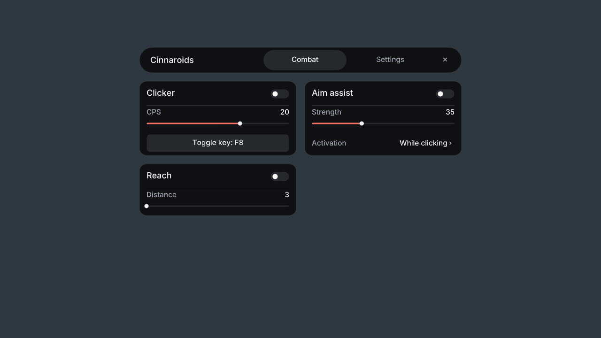

# Cinnaroids

Clicker, player aim assist, and reach for Cinnabar, controlled in-game with **Right Shift**.

Open **Cinnaroids.exe** before or while your installed Cinnabar is running. It attaches automatically to the standard installation; press **Right Shift** to manage modules. **F10** stops all modules. Cinnaroids never starts the game.

Rust + GPUI launcher and a WASM module. Build: `cargo run --release --locked`. [Setup](docs/modules.md).
